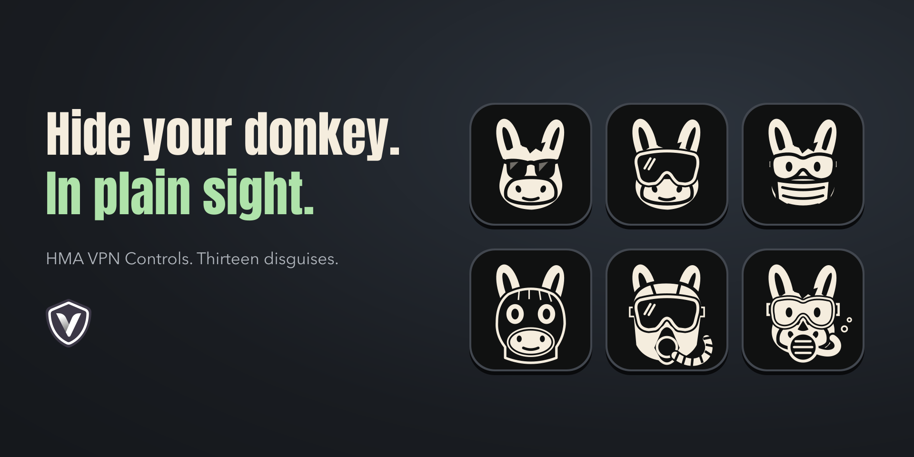
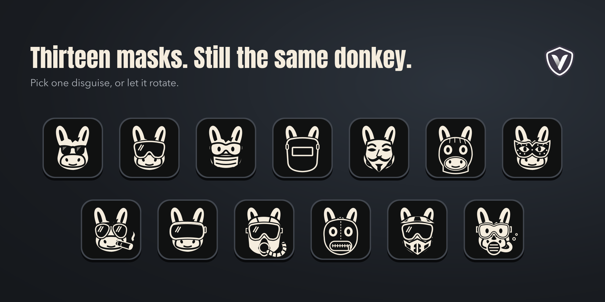
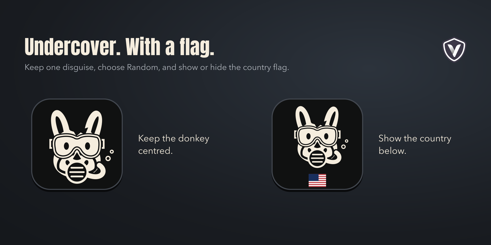

<p align="center">
  
</p>

<h1 align="center">HMA VPN Controls</h1>

<p align="center"><strong>Version 1.0</strong></p>

Put your donkey in disguise. One key controls HMA VPN on your Mac.

Press to connect or disconnect. Hold to request a new IP in the same country or cycle through your country list. Choose a fixed or random mask and show or hide the country flag. The donkey stays unmasked while reconnecting.

Requires Stream Deck 6.9+, macOS 13+, an installed and signed-in HMA VPN app, and Accessibility access.

If you find this useful, follow @teamvrotek on <a href="https://github.com/teamvrotek" target="_blank" rel="noopener noreferrer">GitHub</a> or <a href="https://www.instagram.com/teamvrotek/" target="_blank" rel="noopener noreferrer">Instagram</a>. Your support helps us feel more special, thank you.



*All previews use sample data.*

## Install and set up

HMA must be signed in with an **active subscription** and its **interface set to English**. The installer includes helpers for Apple Silicon and Intel Macs. Stream Deck supplies the plugin's runtime, so you do not need to install Node.js to use it.

1. Build the installer using [Build from source](#build-from-source), then open `Release/com.teamvrotek.hmacontrols.streamDeckPlugin`.
2. Find **HMA VPN Controls** in the action list and drag **VPN control** onto a key.
3. Open HMA and sign in. Allow **Stream Deck** in **System Settings > Privacy & Security > Accessibility**, then restart Stream Deck.
4. Select the key in Stream Deck to choose its mask, show or hide the country flag, and set what a long press does.

If the key needs attention, its settings show the reason and the relevant **Open HMA**, **Accessibility**, or **Check again** action. Accessibility access is managed in **System Settings > Privacy & Security > Accessibility**.

## When HMA is closed or missing

If HMA is installed but fully quit, using the key starts it in the background and continues once it is ready. Status checks alone do not launch HMA.

If HMA is not installed, the settings show **Get HMA** and **Check again**. Clicking **Get HMA** opens HMA's official Mac download page. Install HMA and sign in to use the key.

## Choose a mask

**Random** is the default. It chooses one of 13 masks for each new connection and keeps it while that connection is active. For an active connection, changing identity removes the mask and shows the loading spinner while HMA reconnects. If the VPN is off, the donkey stays unmasked while connecting. Once HMA confirms the connection, Random puts on a different mask. A fixed choice keeps the same mask. You can also choose a specific mask, from the original sunglasses to goggles, helmets and face masks.



**Show country flag** is on by default. The flag sits at the bottom of the key. The spinner and question mark sit in the bottom-left corner. Turn it off to centre the donkey without a flag. Each key keeps its own appearance settings.



## Tap or hold

Tap the key to turn the VPN on or off. The key updates when the connection changes in HMA too.


Select your key in Stream Deck to change **Long press**. Each key keeps its own setting.

| Long press | What happens |
|---|---|
| Change identity (new IP) | Requests a new IP in the current country, connecting if the VPN is off. This is the default. |
| Next country | Selects the next country in your ordered list and connects, even when the VPN is off. |
| Do nothing | Holding the key has no action. |

Hold for **0.7 seconds** to use the long press action. Changing identity may return the same IP address.

| Fixed mask | Random mask |
|---|---|
|  |  |

For **Next country**, choose at least two countries from HMA's Recent Locations menu. Visit a country in HMA first to add it to that menu. The key cycles through your chosen order. If HMA's country controls are unavailable, the settings explain this and keep your saved selection.


## How it works

The plugin controls the installed HMA app through a local macOS helper and Accessibility. HMA manages the VPN connection and your account. The plugin reads HMA's menu bar status and connected country, including when its main window is closed. It checks immediately when the key appears and every three seconds afterward, so an already active VPN is detected at startup. Connecting, disconnecting and changing identity use the menu bar controls without opening the main window. Virtual IP is optional and is only read when HMA exposes it; the plugin does not claim a new IP was assigned unless it can compare both addresses.

The integration has been tested with **HMA 25.8.3**. It depends on HMA's interface, so an HMA update can require a plugin update. Reconnecting or changing country can briefly interrupt the connection. HMA's own Kill Switch setting controls how it handles that interruption.

## Troubleshooting

| What happens | What to check |
|---|---|
| Permission is needed | Open **Accessibility** from the key's settings, enable access for **Stream Deck**, then restart Stream Deck. |
| HMA is unavailable | Open HMA, check that you are signed in, then choose **Check again**. |
| The helper cannot run | Reinstall the latest HMA VPN Controls build. |
| Next country is unavailable | Open HMA and check that its location controls are available. Your country list remains saved. |
| Reconnecting keeps the same IP | HMA may assign the same IP again. Try another country if you need a different location. |
| The key does not match HMA | Check the message in the settings panel. If this began after an HMA update, its interface may have changed. |

## Build from source

Building requires **Node.js 20.5.1 or later**, npm and Apple's **Xcode Command Line Tools**. Build on macOS to compile the native helper for Apple Silicon and Intel.

```bash
cd hma-vpn-controls
./build.sh
```

The installer is written to `Release/com.teamvrotek.hmacontrols.streamDeckPlugin`. Open it to install the plugin. Stream Deck supplies the runtime for the installed plugin.

## Customize the artwork

The donkey is drawn in [renderer.js](com.teamvrotek.hmacontrols.sdPlugin/renderer.js), and the disguises are drawn in [masks.js](com.teamvrotek.hmacontrols.sdPlugin/masks.js). Edit those SVG drawings and run `./build.sh` to build your own version with the updated artwork.

The app and action icons are included under `com.teamvrotek.hmacontrols.sdPlugin/imgs/`, with editable SVG originals in `imgs/sources/`. When replacing a static icon, export both its regular and `@2x` PNG files.

## Privacy

The plugin uses local communication with Stream Deck and the installed HMA app. Your key settings stay on your computer. It does not need your HMA password or a separate API key. HMA handles VPN traffic under its own privacy policy.

## License

MIT, see [LICENSE](LICENSE). Copyright © 2026 VROTEK OÜ.
